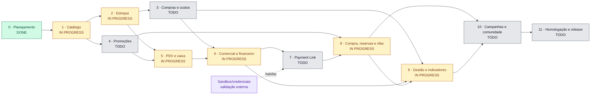

# Roadmap oficial — conclusão Germinatura v2.2

Replanejado em 07/09/2026 pelo plano aprovado. Substitui congelamento em 10/09 e promoção em 11/09 por marcos de aceite, sem nova promessa de data. Fonte: especificação v2.2, PRD e ADRs 0001–0010. A matriz em [REQUIREMENTS_MATRIX.md](REQUIREMENTS_MATRIX.md) distingue backend, interface, testes, staging e produção.

Estados: `TODO`, `IN PROGRESS`, `BLOCKED`, `DONE`. DONE exige jornada completa, testes e homologação do marco. Um backend integrado não torna o módulo inteiro concluído. Integração indisponível não conta como implementação.

## Base auditada

Snapshot de 10/09/2026: `main` permanece em `95c4209`; `develop` avançou para `dc9007c` com documentação reconciliada, categorias, perfil/navegação e administração transacional de produtos, preços e imagens. A divergência mede conteúdo, não quantidade de features nem prontidão de produção.

O PR #59 de imagens foi integrado em `develop` depois do PR #55 de produtos e do PR #57 de preços. Quality pós-merge `34515563525` e Deploy Staging `34515563962` concluíram verdes; health, catálogo via Service Binding e bloqueio anônimo do upload foram confirmados. O catálogo de staging está vazio e a fixture local não autentica nesse ambiente, então a oferta completa ainda requer uma conta de homologação para o smoke autenticado. Produção não foi acessada.

## Visualização do andamento

| Situação | Etapas | Leitura operacional |
| --- | --- | --- |
| `DONE` | 0 | Planejamento, matriz, ADR de Payment Link/dinheiro e regras de release reconciliados |
| `IN PROGRESS` | 1, 2, 5, 6, 8, 9 | Há backend ou interface útil, mas ainda faltam jornadas, testes ou homologação para fechar o marco |
| `TODO` | 3, 4, 7, 10, 11 | Trabalho substancial ainda não iniciado ou não disponível como jornada completa |

## Marcos de entrega

| Etapa | Estado | Dependências | Entregas e aceite |
| --- | --- | --- | --- |
| 0 — Reconciliação | DONE | Aprovação do plano | Especificação, PRD, gaps, matriz e ADR Payment Link/dinheiro coerentes; revisão documental, PR e CI. Consulta oficial feita; acesso sandbox ainda não validado |
| 1 — Catálogo administrável | IN PROGRESS | 0 | Produtos/categorias, SKU, imagens Storage, canais, reserva/lote e preços auditados integrados em staging; falta o smoke autenticado da oferta completa |
| 2 — Operação de estoque | IN PROGRESS | 1 | Distribuição central→vendedor e solicitação/aceite entre vendedores implementadas; ainda faltam devolução, perda, inventário, ajustes aprovados e conclusão de “Meu estoque”; nenhum saldo direto |
| 3 — Compras e custos | TODO | 1, 2 | Fornecedor, pedidos, custos/frete, recebimento parcial, lotes/validade e obrigação financeira sem duplicação; custo rastreável |
| 4 — Promoções completas | TODO | 1 | Administração e regras percentual, preço fixo, quantidade, leve/pague, combo mix, escalonada e cupom; limites concorrentes e economia explicada |
| 5 — PDV e caixa | IN PROGRESS | 2, 4 | Completar turno, histórico, pendências, dinheiro/troco, método/terminal e fechamento; instalação/atualização PWA nos dispositivos-alvo |
| 6 — Administração comercial/financeira | IN PROGRESS | 3, 5 | Vendas, reversões, contas/categorias, despesas, taxas, recebíveis, conciliação, importação validada por arquivo oficial e CSV real |
| 7 — Payment Link | TODO | 0, 6, sandbox autorizado | Adapter, OAuth backend, consulta/inativação, webhook, replay, reconciliação e estorno; falhas não duplicam efeitos |
| 8 — Compra, reservas e rifas | IN PROGRESS | 4, 7 | Carrinho/pedido/pagamento; preparar/retirar reserva; compra de números e rifa no PDV; publicação/pausa/cancelamento e reembolso seguro |
| 9 — Gestão e indicadores | IN PROGRESS | 3, 6, 8 | Auditoria, configurações, desbloqueios, conta/sessões, Portal→PDV e indicadores completos por período; meta pública configurável |
| 10 — Campanhas e comunidade | TODO | 8, 9 | Vitrine, eventos, links/QR, atribuição, divulgação, preferências/avise-me, segmentação, mural, sugestões, enquetes e moderação |
| 11 — Homologação e release | TODO | 1–10 | Jornada por papel, carga/acessibilidade, backup restaurado, alertas, runbooks, migrations revisadas e promoção autorizada |

## Execução incremental

Cada etapa comporta PRs pequenos e completos. Começar pela administração transacional do catálogo, sem antecipar integrações financeiras. Preservar Next.js/monorepo, contratos Zod, banco transacional e design system aprovado. Investigar contrato e acesso ao sandbox desde a etapa 0; o avanço independente do catálogo não depende de credenciais PicPay.

Por mutação: permission + rota/allowlist + RLS + RPC + idempotência + interface + teste de abuso. Preço é do servidor, histórico é imutável e tarefas secundárias usam outbox. Se a cotação mudar antes de cobrar, confirmar novamente; a reserva comercial conserva o snapshot.

O PWA já integrado permite somente shell/catálogo público datado, primeira página até 50 produtos, TTL 24h e indicação de parcialidade. Nunca cachear sessão, saldo, carrinho ou pagamentos; nenhuma fila offline. O service binding PDV→Portal foi integrado no PR #51, com smoke de catálogo/sessão; instalação real continua pendente.

## Fila contínua de implementação

O trabalho segue sem intervalos entre PRs destinados a `develop`: ao fechar uma fatia com CI, revisão, merge e staging, a próxima branch curta começa do novo `develop`. As únicas pausas obrigatórias são informação externa indispensável, migration destrutiva, segredo/custo de infraestrutura ou autorização do PR final para `main`.

Sequência imediata: obter uma conta de homologação para o smoke autenticado da oferta completa sem bloquear o trabalho independente; concluir devoluções e perdas após distribuição central→vendedor e transferência solicitada/aceita. Produtos, preços e imagens já estão integrados sem carregar commits pré-squash.

| Onda | PRs coesos em ordem | Saída da onda |
| --- | --- | --- |
| A — Fechar catálogo | Administração/histórico de preços; imagens com metadados e ciclo seguro no Storage; smoke integrado e atualização da matriz | Etapa 1 `DONE`: administrador publica uma oferta completa e o catálogo anônimo respeita canal, preço e imagem |
| B — Estoque operacional | Distribuição e localizações; transferência solicitada/aceita; devolução e perda; inventário/ajuste aprovado; “Meu estoque” no PDV | Etapa 2 `DONE`: toda correção é movimento rastreável e disputas não produzem saldo negativo |
| C — Compras e custos | Fornecedores; pedido e itens; frete/rateio; recebimento parcial com lote/validade; obrigação financeira e custo rastreável | Etapa 3 `DONE`: um recebimento repetido não duplica estoque, custo nem obrigação |
| D — Promoções | Administração e precedência; percentual/preço fixo; leve-pague/combo/escalonada; cupons e limites concorrentes; explicação de economia | Etapa 4 `DONE`: cotação é determinística, autoritativa e reserva/consome limites na mesma fronteira transacional |
| E — PDV e caixa | Turno e histórico; pendências; dinheiro recebido/troco; conta de caixa e divergência; método/terminal; orçamento de desempenho e PWA em dispositivos | Etapa 5 `DONE`: vendedor conclui e presta contas por método sem aguardar tarefas secundárias |
| F — Comercial e financeiro | Histórico unificado; cancelamento/reembolso parcial; contas/categorias/despesas; recebíveis/taxas/liquidações; importação com prévia/deduplicação; CSV | Etapa 6 `DONE`: totais paginados e por período reconciliam com os ledgers |
| G — Payment Link | Contratos e intenção persistida; adapter OAuth backend; criação/consulta/inativação; receipt/webhook; recuperação; estorno; sandbox e falhas controladas | Etapa 7 `DONE`: cada pagamento ou estorno produz efeitos exatamente uma vez; flag só liga após homologação |
| H — Compra, reservas e rifas | Carrinho/pedido; acompanhamento/pagamento; preparar/pronta/retirar; seleção e compra de números; rifa no PDV; ciclo editorial e reembolso | Etapa 8 `DONE`: consumidor e vendedor concluem as jornadas, inclusive concorrência e reversões antes/depois do sorteio |
| I — Gestão | Auditoria pesquisável; configurações/desbloqueios; perfil/sessões; indicadores financeiros; meta pública | Etapa 9 `DONE`: cada papel consulta e executa suas responsabilidades com totais completos |
| J — Crescimento e comunidade | Campanhas/eventos; links/QR/origem; textos/preferências/avise-me; segmentação; mural/posts/sugestões/enquetes; denúncias/moderação | Etapa 10 `DONE`: publicação e moderação funcionam de ponta a ponta, com privacidade e permissões testadas |
| K — Release | Jornada por papel; carga/acessibilidade; backup restaurado; alertas/runbooks; revisão de migrations; PR `develop → main` | Etapa 11 `DONE`: revisão homologada pronta para autorização explícita de promoção |

### Trilhas transversais

- **Segurança e contrato:** cada mutação inclui Zod compartilhado, permissionamento por ação, allowlist, RLS, RPC, idempotência, auditoria e teste do papel indevido.
- **Concorrência:** última unidade/número, transferência, limite promocional, recebimento, pagamento e estorno são exercitados contra PostgreSQL real, inclusive replay e ordem invertida.
- **Desempenho do PDV:** registrar baseline antes de ampliar cada jornada, paginar consultas, carregar recursos secundários sob demanda e publicar tarefas após commit por outbox. A CI deve impedir regressões relevantes de bundle e tempo da jornada crítica com base no baseline medido.
- **Fronteiras de implantação:** Portal administrativo, experiência do consumidor, PDV e Jobs compartilham contratos e banco, mas não importam runtime entre apps. APIs/eventos permanecem nas fronteiras para permitir Workers separados no futuro sem assumir custo ou topologia antes de haver medição.
- **Payment Link:** capturar schemas e validar acesso ao sandbox durante as ondas A–F. O restante do projeto continua enquanto esse acesso não for necessário; a onda G não pode ser homologada sem credenciais configuradas diretamente no ambiente governado.
- **Dívida técnica observada:** remover os oito warnings de lint atuais e atualizar as actions antes que a compatibilidade forçada de Node.js 24 deixe de ser tolerada. Essa limpeza deve ocorrer em PR próprio e não será misturada às regras financeiras.

## Gates e lançamento

Aplicar lint, typecheck, unitários, SQL, integração concorrente, E2E Chromium, builds Next/Vinext e scan conforme a mudança. Exigir CI verde, revisão e smoke funcional em staging, além de homologação humana onde indicada na matriz. Alteração documental requer integridade e QA visual do DOCX, links e coerência; não exige recriar runtime.

Casos transversais: última unidade/número, limites promocionais, duplo checkout/recebimento/confirmação/cancelamento, webhook duplicado/fora de ordem, timeout e pagamento tardio, reembolso parcial, dinheiro/troco, retirada, OTP/revogação/último admin, PWA seguro e relatórios além de 100 registros em intervalos fechado-abertos de São Paulo.

Branches curtas de develop, Conventional Commits, PR e squash; nunca force push. Merge automático em develop somente após revisão e CI verde, seguido de CI/deploy/smokes. Promoção consolidada develop→main exige autorização explícita após CI/revisão; a mesma autorização cobre deploy governado e smokes. Nenhum acesso antecipado a produção. A data final depende dos marcos e da homologação Payment Link.

## Evoluções condicionais

App nativo, chat privado, cards automáticos, Web Push, SFTP, Open Finance e integração remota de terminal não bloqueiam o lançamento não opcional. Tap/V.A./V.R. exigem habilitação e processo próprios; permanecem indisponíveis até comprovação. Notificações in-app, campanhas e mural moderado fazem parte deste lançamento. Dinheiro físico foi aprovado com conta/controle próprios (ADR 0010).

## Incremento de categorias — 08/09/2026

A etapa 0 foi integrada no PR #52, develop `6030b14`, com Quality `34175115950` e Staging `34175115940` verdes. A consulta oficial de Payment Link foi concluída; sandbox/credenciais continuam sem validação.

Primeira fatia da etapa 1: categorias com criação, edição, ordenação e inativação por `save_catalog_category` e `POST /api/v1/admin/catalog/categories`. Exige `catalog.manage`, motivo e chave idempotente; revisão otimista rejeita edição concorrente, auditoria guarda antes/depois e tabelas continuam sem escrita direta. Interface `/admin/catalogo/categorias` mostra até 50 por página, permite avançar e explica a inativação. Produtos, preços, imagens e hierarquia continuam pendentes; nenhuma integração financeira foi habilitada.

Evidência local específica: 19 pgTAP novos e teste de concorrência real para uma revisão vencedora e criação repetida. Evidência de integração remota será registrada no PR/handoff após os gates; esta descrição de código não é homologação de staging.

## Incremento de navegação e perfil — 08/09/2026

Etapa 9 em implementação: perfil editável com nome/foto e apresentação, turma e preferências opcionais privadas; acesso compartilhado por papel sem mudança de privilégios. Shell com scroll independente e seletor de visão ADMIN/consumidor. Etapa 5: retorno visível ao Portal no PDV e fechamento carregado sob demanda. A possibilidade de separar Workers está descrita em [PORTAL_EXPERIENCES.md](PORTAL_EXPERIENCES.md), sem decisão de infraestrutura. O PR #54 foi integrado em `develop` (`8ecf543`) com Quality `34258353543` e Deploy Staging `34258353468` verdes; mural, recomendador e demais jornadas continuam pendentes.

Categorias integradas no PR #53 (`248a6f9`), CI e staging verdes em 08/09. A etapa 1 continua aberta para produtos, preços, imagens, canais e demais configurações.

## Incremento de produtos — 09/09/2026

Segunda fatia da etapa 1: produtos têm criação, edição e inativação por `save_catalog_product` e `POST /api/v1/admin/catalog/products`, sempre com `catalog.manage`, motivo, chave idempotente e revisão otimista. O banco gera o SKU canônico no primeiro salvamento e ele permanece imutável; a auditoria preserva antes/depois. Categoria precisa estar ativa. Portal e PDV só podem ser habilitados quando já houver preço vigente, evitando publicar uma oferta sem cotação autoritativa.

A interface `/admin/catalogo` permite configurar categoria, identificador, descrição, atividade, canais, reserva e controle de lote em tela responsiva. Gestão de preço, histórico visível e imagens Storage continuam como próximos incrementos da etapa 1. O PR #55 foi integrado em `develop` (`8511389`); Quality pós-merge `34474857272` e Deploy Staging `34474857241` passaram. O smoke autenticado específico do produto permanece pendente para fechar a evidência da jornada. Produção permanece intacta.

## Incremento de preços — 10/09/2026

Terceira fatia da etapa 1: `set_catalog_product_price` recebe centavos inteiros, motivo, chave idempotente e a revisão atual do produto. A operação bloqueia o produto, fecha somente a vigência aberta, inclui uma nova faixa e incrementa a revisão. Valor e intervalo anteriores nunca são reescritos. Quando já existe um preço futuro, a nova faixa termina no início desse agendamento, mantendo-o preservado.

`POST /api/v1/admin/catalog/product-prices` e `GET /api/v1/admin/catalog/products/:id/prices` exigem `catalog.manage`; a leitura usa cursor por vigência e mostra apenas o histórico do produto autorizado. A interface de `/admin/catalogo` permite informar o valor em reais, consultar histórico paginado e identificar preço vigente, agendado ou encerrado. O PR #57 foi integrado em `develop` (`3c429ce`); Quality pós-merge `34479342406` e Deploy Staging `34479342414` passaram. Imagens Storage e o smoke autenticado da oferta completa continuam pendentes nesta etapa.

## Incremento de imagens — 10/09/2026

O PR #59 adiciona até seis imagens por produto com descrição acessível, ordenação e capa. Objetos usam caminhos imutáveis no bucket público, sem listagem ou sobrescrita; metadados ativos são expostos pela visão anônima somente quando produto e categoria estão publicados. Uploads validam tamanho, MIME e assinatura do arquivo. A remoção oculta primeiro o metadado, exclui pelo Storage API e mantém tombstone auditável, podendo retomar uma limpeza física interrompida.

Portal e PDV mostram a capa sem bloquear o carregamento do catálogo. O service worker do PDV salva apenas a capa pública junto da cópia read-only e mantém vendas/mutações fora do cache. Evidência local: 80 unitários, 858 pgTAP, oito testes de integração concorrente e a jornada E2E de imagem passaram; na suíte completa, 24 jornadas passaram e dois workers falharam antes da execução ao consultar simultaneamente o status local, seguidos por retestes verdes dos dois arquivos. O PR #59 foi integrado em `dc9007c`; Quality `34515563525` e Deploy Staging `34515563962` passaram. O smoke externo confirmou serviços, Service Binding e autorização anônima fechada; a jornada autenticada permanece pendente por falta de conta de homologação no ambiente.

## Incremento de distribuição de estoque — 10/09/2026

Primeira fatia da etapa 2: `distribute_stock` restringe a origem à central ativa e o destino a uma localização ativa de vendedor, então chama a transferência existente sob o mesmo lock, ledger e idempotência. O retorno usa a correlação persistida do movimento, inclusive em replay. `POST /api/v1/admin/inventory/distributions` exige `inventory.manage`; a allowlist aceita Admin ou Estoque e bloqueia Vendedor/Consumidor antes da rota.

A interface `/admin/estoque` lista apenas produtos ativos com saldo disponível na central e exige destino, quantidade inteira e motivo. Ela não altera projeções diretamente e orienta atualização em conflito. Evidência local atual: 81 unitários, 871 pgTAP, oito testes de integração com corrida entre reserva e distribuição e 27/27 E2E Chromium, incluindo bloqueio do consumidor e reversão da preparação do teste. Lint, typecheck, builds Next/Vinext e scan também passaram. O lint do banco repete apenas a pendência histórica de `private.expire_due_generic_stock_reservations`; PR, CI e staging desta fatia ainda estão pendentes.

## Incremento de transferências entre vendedores — 11/09/2026

O vendedor de destino solicita produto e quantidade a outra localização de vendedor. A solicitação não reserva nem movimenta saldo; o vendedor de origem pode aceitar ou recusar e o solicitante pode cancelar enquanto estiver pendente. O aceite revalida as localizações e o disponível dentro da mesma transação, trava os saldos em ordem estável e registra movimento imutável, auditoria, outbox e resultado idempotente. O histórico usa cursor e limite de até 50 registros.

O PDV carrega a área de transferências somente quando a aba é aberta, bloqueia mutações offline e mantém chaves de idempotência durante retentativas incertas. Evidência local: 82 unitários, 897 pgTAP, nove testes de integração concorrente e a jornada Chromium em duas sessões de vendedor. Na bateria E2E ampla, 25 cenários passaram; três esperas em modo dev foram repetidas isoladamente e passaram, incluindo a adaptação do fechamento para uma posição de saldo zero criada por transferência e reversão. Lint, typecheck, builds Next e scan passaram. O advisor do banco repete somente a pendência histórica de `private.expire_due_generic_stock_reservations`.
