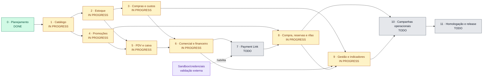

# Roadmap oficial — conclusão Germinatura v2.2

Replanejado em 11/09/2026 após a PR #61 para reduzir o caminho crítico por paralelismo, sem remover escopo, critérios de aceite ou gates. Substitui congelamento em 10/09 e promoção em 11/09 por marcos de aceite, sem nova promessa de data. Fonte: especificação v2.2, PRD e ADRs 0001–0010. A matriz em [REQUIREMENTS_MATRIX.md](REQUIREMENTS_MATRIX.md) distingue backend, interface, testes, staging e produção.

Estados: `TODO`, `IN PROGRESS`, `BLOCKED`, `DONE`. DONE exige jornada completa, testes e homologação do marco. Um backend integrado não torna o módulo inteiro concluído. Integração indisponível não conta como implementação.

## Base auditada

Snapshot de 28/09/2026: `main` permanece em `95c4209` e é ancestral de `develop` desde a PR #75 (merge commit `5cdfdea`, sem alteração de árvore); `develop` está em `1476741` após a PR #82 (promoção escalonada). `main...develop` = `0 65`; 43 migrations integradas. Categorias, produtos, preços, imagens, perfil/navegação, operações de estoque, compras, contas a pagar, rastreabilidade de lotes (PR #73), RBAC fail-closed (PR #76) e as promoções `QUANTIDADE_PRECO` (PR #74), `PERCENTUAL`/`VALOR_FIXO_UNITARIO` (PR #78), `LEVE_PAGUE` (PR #80) e `ESCALONADA` (PR #82), sob a política PROMO-004 (PR #79), estão integrados em staging. A divergência entre branches mede conteúdo e prontidão de produção, não quantidade de features.

A evidência atual do branch `develop` foi registrada em documentação do produto e não substitui qualquer gate externo ou smoke autenticado. O status de staging continua condicionado à conta institucional controlada, à sandbox Payment Link e à homologação humana dos módulos pendentes. Produção não foi acessada.

## Visualização do andamento

| Situação | Etapas | Leitura operacional |
| --- | --- | --- |
| `DONE` | 0 | Planejamento, matriz, ADR de Payment Link/dinheiro e regras de release reconciliados |
| `IN PROGRESS` | 1, 2, 3, 4, 5, 6, 8, 9 | Há backend ou interface útil, mas ainda faltam jornadas, testes ou homologação para fechar o marco |
| `TODO` | 7, 10, 11 | Trabalho substancial ainda não iniciado ou não disponível como jornada completa |

```mermaid
flowchart LR
    E0["0 · Planejamento<br/>DONE"] --> E1["1 · Catálogo<br/>IN PROGRESS"]
    E1 --> E2["2 · Estoque<br/>IN PROGRESS"]
    E1 --> E4["4 · Promoções<br/>IN PROGRESS"]
    E2 --> E3["3 · Compras e custos<br/>IN PROGRESS"]
    E2 --> E5["5 · PDV e caixa<br/>IN PROGRESS"]
    E4 --> E5
    E3 --> E6["6 · Comercial e financeiro<br/>IN PROGRESS"]
    E5 --> E6
    E6 --> E7["7 · Payment Link<br/>TODO"]
    E4 --> E8["8 · Compra, reservas e rifas<br/>IN PROGRESS"]
    E7 --> E8
    E3 --> E9["9 · Gestão e indicadores<br/>IN PROGRESS"]
    E6 --> E9
    E8 --> E9
    E8 --> E10["10 · Campanhas operacionais<br/>TODO"]
    E9 --> E10
    E10 --> E11["11 · Homologação e release<br/>TODO"]
    S["Sandbox/credenciais<br/>validação externa"] -. habilita .-> E7

    classDef done fill:#d1fae5,stroke:#047857,color:#064e3b;
    classDef progress fill:#fef3c7,stroke:#b45309,color:#78350f;
    classDef todo fill:#e5e7eb,stroke:#4b5563,color:#111827;
    classDef external fill:#ede9fe,stroke:#6d28d9,color:#4c1d95;
    class E0 done;
    class E1,E2,E3,E4,E5,E6,E8,E9 progress;
    class E7,E10,E11 todo;
    class S external;
```

## Marcos de entrega

| Etapa | Estado | Dependências | Entregas e aceite |
| --- | --- | --- | --- |
| 0 — Reconciliação | DONE | Aprovação do plano | Especificação, PRD, gaps, matriz e ADR Payment Link/dinheiro coerentes; revisão documental, PR e CI. Consulta oficial feita; acesso sandbox ainda não validado |
| 1 — Catálogo administrável | IN PROGRESS | 0 | Produtos/categorias, SKU, imagens Storage, canais, reserva/lote e preços auditados integrados em staging; falta o smoke autenticado da oferta completa |
| 2 — Operação de estoque | IN PROGRESS | 1 | Distribuição, transferência solicitada/aceita, devolução, perdas, inventário físico, ajustes aprovados e “Meu estoque” integrados em staging; rastreabilidade por lote/local e custo consumido integrados na PR #73; homologação física final pendente; nenhum saldo direto |
| 3 — Compras e custos | IN PROGRESS | 1, 2 | Fornecedores, pedidos, recebimento parcial e liquidação/reversão de contas a pagar integrados em staging; rastreabilidade do lote até venda integrada em staging; homologação física e indicadores consolidados de custo/margem pendentes |
| 4 — Promoções completas | IN PROGRESS | 1 | Administração e regras percentual, preço fixo, quantidade, leve/pague, combo mix, escalonada e cupom; limites concorrentes e economia explicada. Integrado: `QUANTIDADE_PRECO` na cotação/checkout e sua administração versionada (PR #74). `PERCENTUAL` (piso por unidade, a favor do cliente) e `VALOR_FIXO_UNITARIO` integrados (PR #78). Política de concorrência/cumulatividade registrada como PROMO-004 e coberta por testes (PR #79). `LEVE_PAGUE` integrado (PR #80). `ESCALONADA` integrada (PR #82). `COMBO_MIX` integrado com rateio PROMO-005 (PR #84). Cupons (PROMO-006) e limites concorrentes com ledger (PROMO-007) integrados (PR #85); entrada única `get_pricing_inputs` com as versões antigas removidas. A trilha de implementação de promoções está fechada; falta a homologação autenticada em staging (etapa permanece `IN PROGRESS` até ela) e a variante de leve/pague com item descontado |
| 5 — PDV e caixa | IN PROGRESS | 2, 4 | Completar turno, histórico, pendências, dinheiro/troco, método/terminal e fechamento; instalação/atualização PWA nos dispositivos-alvo. Integrado: turno do vendedor e dinheiro físico com troco e fechamento contado (PAY-009a, #87); devolução física no estorno (`REFUND_PAYOUT`) e conferência financeira dos turnos (#88). "Minhas vendas" e pendências (PDV-002, #89). Método do cartão e terminal da Maquininha (PAY-005a, #90). Restante: homologação física |
| 6 — Administração comercial/financeira | IN PROGRESS | 3, 5 | Vendas, reversões comuns e contas a pagar com liquidação parcial/reversão integradas; tela Financeiro › Vendas com filtros, detalhe e estorno (SALE-004, #91); plano de categorias, contas/caixas e lançamentos manuais auditados (FIN-005, #92); extrato consolidado com CSV (FIN-006, #94); faltam contas/categorias gerais, despesas, taxas, recebíveis, importação validada por arquivo oficial e CSV real |
| 7 — Payment Link | CODE COMPLETE — homologação externa bloqueada | 0, 6, sandbox autorizado | Código completo, com flag `payment_link` desligada. Integrados: fundação (#103), ciclo de vida (#104), verificação do sandbox (#105, #107, #110–#112), tela do vendedor (#106), Financeiro › Pagamentos online (#108), pagamento online de reserva pelo consumidor (#109) e resultados do sandbox (#113). Bloqueio externo: a API de links do sandbox PicPay não responde (timeout/502, OAuth funciona) e o webhook depende da `PICPAY_PAYMENT_LINK_WEBHOOK_KEY`, que exige a URL de notificação habilitada pela PicPay. Enquanto isso só runbook e testes são mantidos |
| 8 — Compra, reservas e rifas | IN PROGRESS | 4, 7 | Administração de reservas com prazos configuráveis e preparo para retirada (RES-002, #95). Retirada no PDV com cobrança pelo preço congelado (RES-003, #96). Carrinho de reserva no catálogo do Portal (RES-004, #97). Pagamento online da reserva (#109). Ciclo de vida da rifa e privacidade dos compradores (RAF-002, #114). Compra online de números pelo consumidor e Meus bilhetes (RAF-003, #115). Venda de números no PDV (RAF-004, #116). Estorno de venda de rifa paga (RAF-005, #117). Avisos da rifa pelo cliente da venda e lista de compradores (RAF-006, #118). Em PR: entrega no PDV de pedido pago online (RES-005). Restante: homologação física com o PicPay (Etapa 7) |
| 9 — Gestão e indicadores | IN PROGRESS | 3, 6, 8 | Auditoria, configurações, desbloqueios, conta/sessões, Portal→PDV e indicadores completos por período; meta pública configurável |
| 10 — Campanhas operacionais | IN PROGRESS | 8, 9 | Avisos operacionais automáticos (NOTIF-002, #98). Avisos manuais segmentados (NOTIF-003, #99). Preferências e avise-me (NOTIF-004, #100). Novidades de produtos, promoções e rifas (NOTIF-005, #101). Divulgação rastreável com texto, link, QR Code e atribuição de reservas (GROW-001, #102). Marco 1: vitrine, eventos, links/QR, atribuição, divulgação, preferências/avise-me e segmentação ligados a cardápio, pedidos, reservas e vendas. A Rede Social Germinare (mural, posts, comentários, sugestões, enquetes, denúncias e moderação social) é Marco 2 |
| 11 — Homologação e release | TODO | 1–10 | Jornada por papel, carga/acessibilidade, backup restaurado, alertas, runbooks, migrations revisadas e promoção autorizada |

## Plano paralelo de conclusão

O caminho crítico foi dividido em braços que avançam simultaneamente e convergem na homologação integrada:

| Onda | Trilhas paralelas | Saída objetiva | Esforço relativo |
| --- | --- | --- | --- |
| 0 — Controle e desbloqueios | Documentação/evidências; limpeza de CI; conta institucional; acesso sandbox e URL de webhook | Estado real registrado e gates externos com responsável, sem secrets no Git ou chat | P |
| 1 — Fundações transacionais | Estoque; compras; promoções; intenção/receipt de pagamento; sessões/auditoria; contratos de campanhas/comunidade | Contratos, permissões e invariantes estáveis para as jornadas seguintes | GG |
| 2 — Operação interna | Devolução/perda/inventário; recebimento/custo; promoções completas; turno/caixa; financeiro; campanhas | Operação interna completa e custos rastreáveis | GG |
| 3 — Compra e pagamento | Carrinho/pedido; Payment Link; reservas; rifas; reembolsos; importação/CSV | Venda, estoque e financeiro refletem pagamento ou estorno exatamente uma vez | GG |
| 4 — Gestão e comunicação operacional | Indicadores; auditoria; conta/sessões; notificações operacionais (mural, enquetes e moderação ficam para o Marco 2) | Cada papel conclui sua jornada e papéis indevidos são bloqueados também no banco | G |
| 5 — Homologação contínua | Staging por PR; concorrência; acessibilidade; desempenho; dispositivos; migrations; restore e alertas | A homologação final contém somente integração cruzada e correções residuais | G |
| 6 — Candidato e release | SHA congelado, gates completos, runbooks e PR `develop → main` | Revisão homologada pronta para autorização explícita | M |

Dependências críticas: estoque→compras/custos→financeiro/margem; catálogo→promoções→carrinho/pedidos; intenção local + credenciais→Payment Link→reservas/rifas/reembolsos. Campanhas editoriais, sessões, auditoria e notificações operacionais avançam sem esperar Payment Link. A Rede Social Germinare fica fora do caminho do Marco 1. O adapter pode ser construído e testado com contratos oficiais e fixtures locais, mas sandbox e webhook real não serão declarados homologados sem credenciais configuradas no ambiente governado.

### Fronteiras para trabalho paralelo

- Estoque/compras concentra migrations e APIs de inventário/procurement e a área de estoque do PDV.
- Pricing/promoções concentra `packages/domain`, contratos de cotação e migrations de promoção.
- Pagamentos/financeiro concentra `packages/payments`, ledger financeiro, Jobs e integrações externas.
- Portal consumidor/crescimento consome os contratos publicados por APIs/eventos e não importa runtimes administrativos.
- Gestão/qualidade concentra auditoria, indicadores, sessões, smokes, acessibilidade e runbooks.
- Cada migration recebe número reservado; uma migration já integrada nunca é editada. Mudanças em permissões, flags e barrels compartilhados entram antes em PR de contrato pequeno.

### Bloqueios externos antecipados

| Bloqueio | Necessário para | Trabalho independente permitido |
| --- | --- | --- |
| Conta institucional controlada em staging | Smoke autenticado, SMTP/bootstrap e autorização por papel | Desenvolvimento local e smokes anônimos |
| `client_id`/`client_secret` de sandbox Payment Link | Chamadas reais ao sandbox | Intenção, adapter, receipt, replay e testes locais fail-closed |
| URL HTTPS e API Key do webhook | Webhook real | Parser, deduplicação e ordem invertida por fixture |
| Arquivos exportados pelo PicPay Empresas | Homologar importação/conciliação | Schema, prévia, validação e deduplicação por fixture |
| Dispositivos, terminais e conferência humana | PWA, Maquininha e caixa físico | E2E browser, bundle e regras transacionais |
| Ambiente de restore | Continuidade operacional | Scripts e runbooks |

Não podem ser acelerados sem perda de qualidade: sandbox e habilitação reais, operação física de caixa/terminal, instalação PWA nos dispositivos-alvo, restore, carga integrada e autorização final para `main`.

## Execução incremental

Cada etapa comporta PRs pequenos e completos. O catálogo transacional e as operações previstas de estoque já estão integrados em staging. Compras começou pelo cadastro completo de fornecedores e seguirá com pedidos e recebimentos. Em paralelo, as trilhas independentes iniciam contratos de promoções, pagamentos e comunidade. Preservar Next.js/monorepo, contratos Zod, banco transacional e design system aprovado.

Por mutação: permission + rota/allowlist + RLS + RPC + idempotência + interface + teste de abuso. Preço é do servidor, histórico é imutável e tarefas secundárias usam outbox. Se a cotação mudar antes de cobrar, confirmar novamente; a reserva comercial conserva o snapshot.

O PWA já integrado permite somente shell/catálogo público datado, primeira página até 50 produtos, TTL 24h e indicação de parcialidade. Nunca cachear sessão, saldo, carrinho ou pagamentos; nenhuma fila offline. O service binding PDV→Portal foi integrado no PR #51, com smoke de catálogo/sessão; instalação real continua pendente.

## Fila contínua de implementação

O trabalho segue em trilhas paralelas e sem intervalos entre PRs destinados a `develop`: ao fechar uma fatia com CI, revisão, merge e staging, a próxima branch curta começa do novo `develop`. As únicas pausas obrigatórias são informação externa indispensável, migration destrutiva, segredo/custo de infraestrutura ou autorização do PR final para `main`.

Ordem do Marco 1 depois de promoções (decisão de 28/09/2026): PDV/caixa → comercial/financeiro essencial → cliente/cardápio/pedidos → comunicação operacional → Payment Link → gestão/release.

Sequência imediata: a administração de `QUANTIDADE_PRECO` com histórico e concorrência foi integrada pela PR #74; percentual/preço fixo foram integrados pela PR #78 e a política de concorrência foi fixada em PROMO-004; a seguir, avançar pelas regras leve-pague/combo/escalonada antes de cupons e limites transacionais. A conta institucional será solicitada quando o smoke autenticado puder ser executado; credenciais Payment Link e API Key do webhook serão solicitadas apenas quando o adapter fail-closed estiver pronto para sandbox. Produtos, preços, imagens, operações previstas de estoque e recebimentos de compra já estão integrados em staging. Fornecedores, pedidos e recebimentos foram integrados pelas PRs #66, #67 e #70.

| Trilha | PRs coesos em ordem interna | Saída da trilha |
| --- | --- | --- |
| A — Fechar catálogo | Administração/histórico de preços; imagens com metadados e ciclo seguro no Storage; smoke integrado e atualização da matriz | Etapa 1 `DONE`: administrador publica uma oferta completa e o catálogo anônimo respeita canal, preço e imagem |
| B — Estoque operacional | Distribuição e localizações; transferência solicitada/aceita; devolução e perda; inventário/ajuste aprovado; “Meu estoque” no PDV | Etapa 2 `DONE`: toda correção é movimento rastreável e disputas não produzem saldo negativo |
| C — Compras e custos | Fornecedores; pedido e itens; frete/rateio; recebimento parcial com lote/validade; obrigação financeira e custo rastreável | Etapa 3 `DONE`: um recebimento repetido não duplica estoque, custo nem obrigação |
| D — Promoções | Administração e precedência; percentual/preço fixo; leve-pague/combo/escalonada; cupons e limites concorrentes; explicação de economia | Etapa 4 `DONE`: cotação é determinística, autoritativa e reserva/consome limites na mesma fronteira transacional |
| E — PDV e caixa | Turno e histórico; pendências; dinheiro recebido/troco; conta de caixa e divergência; método/terminal; orçamento de desempenho e PWA em dispositivos | Etapa 5 `DONE`: vendedor conclui e presta contas por método sem aguardar tarefas secundárias |
| F — Comercial e financeiro | Histórico unificado; cancelamento/reembolso parcial; contas/categorias/despesas; recebíveis/taxas/liquidações; importação com prévia/deduplicação; CSV | Etapa 6 `DONE`: totais paginados e por período reconciliam com os ledgers |
| G — Payment Link | Contratos e intenção persistida; adapter OAuth backend; criação/consulta/inativação; receipt/webhook; recuperação; estorno; sandbox e falhas controladas | Etapa 7 `DONE`: cada pagamento ou estorno produz efeitos exatamente uma vez; flag só liga após homologação |
| H — Compra, reservas e rifas | Carrinho/pedido; acompanhamento/pagamento; preparar/pronta/retirar; seleção e compra de números; rifa no PDV; ciclo editorial e reembolso | Etapa 8 `DONE`: consumidor e vendedor concluem as jornadas, inclusive concorrência e reversões antes/depois do sorteio |
| I — Gestão | Auditoria pesquisável; configurações/desbloqueios; perfil/sessões; indicadores financeiros; meta pública | Etapa 9 `DONE`: cada papel consulta e executa suas responsabilidades com totais completos |
| J — Campanhas operacionais | Campanhas/eventos; links/QR/origem; textos/preferências/avise-me; segmentação ligados a cardápio, pedidos, reservas e vendas | Etapa 10 `DONE` no Marco 1: campanhas e notificações operacionais funcionam de ponta a ponta. A Rede Social Germinare (mural/posts/sugestões/enquetes/denúncias/moderação) é Marco 2 |
| K — Release | Jornada por papel; carga/acessibilidade; backup restaurado; alertas/runbooks; revisão de migrations; PR `develop → main` | Etapa 11 `DONE`: revisão homologada pronta para autorização explícita de promoção |

### Trilhas transversais

- **Segurança e contrato:** cada mutação inclui Zod compartilhado, permissionamento por ação, allowlist, RLS, RPC, idempotência, auditoria e teste do papel indevido.
- **Concorrência:** última unidade/número, transferência, limite promocional, recebimento, pagamento e estorno são exercitados contra PostgreSQL real, inclusive replay e ordem invertida.
- **Desempenho do PDV:** registrar baseline antes de ampliar cada jornada, paginar consultas, carregar recursos secundários sob demanda e publicar tarefas após commit por outbox. A CI deve impedir regressões relevantes de bundle e tempo da jornada crítica com base no baseline medido.
- **Fronteiras de implantação:** Portal administrativo, experiência do consumidor, PDV e Jobs compartilham contratos e banco, mas não importam runtime entre apps. APIs/eventos permanecem nas fronteiras para permitir Workers separados no futuro sem assumir custo ou topologia antes de haver medição.
- **Payment Link:** capturar schemas e validar acesso ao sandbox durante as ondas A–F. O restante do projeto continua enquanto esse acesso não for necessário; a onda G não pode ser homologada sem credenciais configuradas diretamente no ambiente governado.
- **Dívida técnica observada:** os warnings de lint foram zerados pela PR #76 (medição de 27/09/2026: 0 erros; Portal 0 e PDV 0 warnings); o orçamento em `quality/legacy-eslint-budget.json` ainda tolera 11 no Portal e 8 no PDV e pode ser reduzido a zero. Falta atualizar as actions antes que a compatibilidade forçada de Node.js 24 deixe de ser tolerada. Essa limpeza deve ocorrer em PR próprio e não será misturada às regras financeiras.

## Gates e lançamento

Aplicar lint, typecheck, unitários, SQL, integração concorrente, E2E Chromium, builds Next/Vinext e scan conforme a mudança. Exigir CI verde, revisão e smoke funcional em staging, além de homologação humana onde indicada na matriz. Alteração documental requer integridade e QA visual do DOCX, links e coerência; não exige recriar runtime.

Casos transversais: última unidade/número, limites promocionais, duplo checkout/recebimento/confirmação/cancelamento, webhook duplicado/fora de ordem, timeout e pagamento tardio, reembolso parcial, dinheiro/troco, retirada, OTP/revogação/último admin, PWA seguro e relatórios além de 100 registros em intervalos fechado-abertos de São Paulo.

Branches curtas de develop, Conventional Commits, PR e squash; nunca force push. Merge automático em develop somente após revisão e CI verde, seguido de CI/deploy/smokes. Promoção consolidada develop→main exige autorização explícita após CI/revisão; a mesma autorização cobre deploy governado e smokes. Nenhum acesso antecipado a produção. A data final depende dos marcos e da homologação Payment Link.

## Evoluções condicionais

App nativo, chat privado, cards automáticos, Web Push, SFTP, Open Finance e integração remota de terminal não bloqueiam o lançamento não opcional. Tap/V.A./V.R. exigem habilitação e processo próprios; permanecem indisponíveis até comprovação. Notificações in-app e campanhas necessárias a cardápio, pedidos, reservas e vendas fazem parte do primeiro go-live (Marco 1). O mural moderado e demais recursos da Rede Social Germinare são Marco 2, depois do site operacional em produção. Dinheiro físico foi aprovado com conta/controle próprios (ADR 0010).

## Incremento de categorias — 08/09/2026

A etapa 0 foi integrada no PR #52, develop `6030b14`, com Quality `34175115950` e Staging `34175115940` verdes. A consulta oficial de Payment Link foi concluída; sandbox/credenciais continuam sem validação.

Primeira fatia da etapa 1: categorias com criação, edição, ordenação e inativação por `save_catalog_category` e `POST /api/v1/admin/catalog/categories`. Exige `catalog.manage`, motivo e chave idempotente; revisão otimista rejeita edição concorrente, auditoria guarda antes/depois e tabelas continuam sem escrita direta. Interface `/admin/catalogo/categorias` mostra até 50 por página, permite avançar e explica a inativação. Produtos, preços, imagens e hierarquia continuam pendentes; nenhuma integração financeira foi habilitada.

Evidência local específica: 19 pgTAP novos e teste de concorrência real para uma revisão vencedora e criação repetida. Evidência de integração remota será registrada no PR/handoff após os gates; esta descrição de código não é homologação de staging.

## Incremento de navegação e perfil — 08/09/2026

Etapa 9 em implementação: perfil editável com nome/foto e apresentação, turma e preferências opcionais privadas; acesso compartilhado por papel sem mudança de privilégios. Shell com scroll independente e seletor de visão ADMIN/consumidor. Etapa 5: retorno visível ao Portal no PDV e fechamento carregado sob demanda. A possibilidade de separar Workers está descrita em [PORTAL_EXPERIENCES.md](PORTAL_EXPERIENCES.md), sem decisão de infraestrutura. O PR #54 foi integrado em `develop` (`8ecf543`) com Quality `34258353543` e Deploy Staging `34258353468` verdes; mural, recomendador e demais jornadas continuam pendentes.

Categorias integradas no PR #53 (`248a6f9`), CI e staging verdes em 08/09. A etapa 1 continua aberta para produtos, preços, imagens, canais e demais configurações.

## Incremento de produtos — 09/09/2026

Segunda fatia da etapa 1: produtos têm criação, edição e inativação por `save_catalog_product` e `POST /api/v1/admin/catalog/products`, sempre com `catalog.manage`, motivo, chave idempotente e revisão otimista. O banco gera o SKU canônico no primeiro salvamento e ele permanece imutável; a auditoria preserva antes/depois. Categoria precisa estar ativa. Portal e PDV só podem ser habilitados quando já houver preço vigente, evitando publicar uma oferta sem cotação autoritativa.

A interface `/admin/catalogo` permite configurar categoria, identificador, descrição, atividade, canais, reserva e controle de lote em tela responsiva. Gestão de preço, histórico visível e imagens Storage continuam como próximos incrementos da etapa 1. O PR #55 foi integrado em `develop` (`8511389`); Quality pós-merge `34474857272` e Deploy Staging `34474857241` passaram. O smoke autenticado específico do produto permanece pendente para fechar a evidência da jornada. Produção permanece intacta.

## Incremento de preços — 10/09/2026

Terceira fatia da etapa 1: `set_catalog_product_price` recebe centavos inteiros, motivo, chave idempotente e a revisão atual do produto. A operação bloqueia o produto, fecha somente a vigência aberta, inclui uma nova faixa e incrementa a revisão. Valor e intervalo anteriores nunca são reescritos. Quando já existe um preço futuro, a nova faixa termina no início desse agendamento, mantendo-o preservado.

`POST /api/v1/admin/catalog/product-prices` e `GET /api/v1/admin/catalog/products/:id/prices` exigem `catalog.manage`; a leitura usa cursor por vigência e mostra apenas o histórico do produto autorizado. A interface de `/admin/catalogo` permite informar o valor em reais, consultar histórico paginado e identificar preço vigente, agendado ou encerrado. O PR #57 foi integrado em `develop` (`3c429ce`); Quality pós-merge `34479342406` e Deploy Staging `34479342414` passaram. Imagens Storage e o smoke autenticado da oferta completa continuam pendentes nesta etapa.

## Incremento de imagens — 10/09/2026

O PR #59 adiciona até seis imagens por produto com descrição acessível, ordenação e capa. Objetos usam caminhos imutáveis no bucket público, sem listagem ou sobrescrita; metadados ativos são expostos pela visão anônima somente quando produto e categoria estão publicados. Uploads validam tamanho, MIME e assinatura do arquivo. A remoção oculta primeiro o metadado, exclui pelo Storage API e mantém tombstone auditável, podendo retomar uma limpeza física interrompida.

Portal e PDV mostram a capa sem bloquear o carregamento do catálogo. O service worker do PDV salva apenas a capa pública junto da cópia read-only e mantém vendas/mutações fora do cache. Evidência local: 80 unitários, 858 pgTAP, oito testes de integração concorrente e a jornada E2E de imagem passaram; na suíte completa, 24 jornadas passaram e dois workers falharam antes da execução ao consultar simultaneamente o status local, seguidos por retestes verdes dos dois arquivos. O PR #59 foi integrado em `dc9007c`; Quality `34515563525` e Deploy Staging `34515563962` passaram. O smoke externo confirmou serviços, Service Binding e autorização anônima fechada; a jornada autenticada permanece pendente por falta de conta de homologação no ambiente.

## Incremento de distribuição de estoque — 10/09/2026

Primeira fatia da etapa 2: `distribute_stock` restringe a origem à central ativa e o destino a uma localização ativa de vendedor, então chama a transferência existente sob o mesmo lock, ledger e idempotência. O retorno usa a correlação persistida do movimento, inclusive em replay. `POST /api/v1/admin/inventory/distributions` exige `inventory.manage`; a allowlist aceita Admin ou Estoque e bloqueia Vendedor/Consumidor antes da rota.

A interface `/admin/estoque` lista apenas produtos ativos com saldo disponível na central e exige destino, quantidade inteira e motivo. Ela não altera projeções diretamente e orienta atualização em conflito. Evidência local: 81 unitários, 871 pgTAP, oito testes de integração com corrida entre reserva e distribuição e 27/27 E2E Chromium, incluindo bloqueio do consumidor e reversão da preparação do teste. Lint, typecheck, builds Next/Vinext e scan passaram. O PR #60 foi integrado em `2661f04`; Quality `34596425614` e Staging `34596425610` verdes.

## Incremento de devolução de estoque — 11/09/2026

O vendedor solicita a devolução do próprio saldo no PDV e pode cancelá-la enquanto pendente. A solicitação não movimenta estoque. Administração ou Estoque confere a entrega física no Portal e confirma ou recusa; somente a confirmação executa, sob locks estáveis, uma transferência imutável do vendedor para a central. Solicitação, decisão, movimento, auditoria, outbox e resposta idempotente permanecem correlacionados. A allowlist e o banco negam consumidores e impedem que o vendedor confirme o próprio recebimento.

Evidência local: migration aplicada por reset limpo; 83 testes unitários, 925 pgTAP, dez testes de integração e 29 cenários E2E Chromium passaram na ordem governada, incluindo replay depois da mudança de saldo, corrida da última unidade e jornada móvel completa de devolução. Lint concluiu com zero erros e oito avisos históricos no Portal; typecheck, builds e scan passaram. O PR #63 foi integrado em `1946889`; Quality `34881831868` e Staging `34881831884` verdes.

## Incremento de inventário físico — 15/09/2026

A contagem registra o saldo físico e reservado esperado e não altera estoque antes da decisão. Administração ou Estoque confirma sob locks estáveis; qualquer movimento posterior ao snapshot produz conflito, e diferenças aceitas geram somente movimentos imutáveis `AJUSTE_POSITIVO`/`AJUSTE_NEGATIVO`. O PDV oferece “Meu estoque” com saldos, movimentos, atalhos operacionais e contagem bloqueada offline. O PR #65 foi integrado em `246c185`; Quality `34997409999` e Staging `34997410056` verdes, incluindo migration, Portal, PDV, Jobs, health checks e Service Binding.

## Incremento de fornecedores — 15/09/2026

Primeira fatia da etapa 3: Administração e Estoque cadastram, pesquisam, editam e inativam fornecedores em `/admin/compras`. `save_supplier` normaliza e protege documento único, exige ao menos um contato, usa revisão otimista, idempotência, auditoria e outbox; RLS e a allowlist negam os demais papéis. PR #66 integrada em `478d0b6`, Quality `35267603831` e staging `35267603805` verdes.

## Incremento de transferências entre vendedores — 11/09/2026

O vendedor de destino solicita produto e quantidade a outra localização de vendedor. A solicitação não reserva nem movimenta saldo; o vendedor de origem pode aceitar ou recusar e o solicitante pode cancelar enquanto estiver pendente. O aceite revalida as localizações e o disponível dentro da mesma transação, trava os saldos em ordem estável e registra movimento imutável, auditoria, outbox e resultado idempotente. O histórico usa cursor e limite de até 50 registros.

O PDV carrega a área de transferências somente quando a aba é aberta, bloqueia mutações offline e mantém chaves de idempotência durante retentativas incertas. Evidência local: 82 unitários, 897 pgTAP, nove testes de integração concorrente e a jornada Chromium em duas sessões de vendedor. Na bateria E2E ampla, 25 cenários passaram; três esperas em modo dev foram repetidas isoladamente e passaram, incluindo a adaptação do fechamento para uma posição de saldo zero criada por transferência e reversão. Lint, typecheck, builds Next e scan passaram. O advisor do banco repete somente a pendência histórica de `private.expire_due_generic_stock_reservations`.

## Incremento de pedidos de compra — 18/09/2026

Administração/Estoque registra pedido com fornecedor ativo, itens, custo unitário em centavos, frete, outros custos, previsão, pagamento previsto e motivo. O banco calcula subtotal/total, congela SKU/nome e custo por item, exige idempotência e registra auditoria/outbox. Consulta paginada e cancelamento motivado preservam histórico; consumidores são bloqueados na página, API e RLS. PR #67 integrada em `b91a0ed`, com Quality `35372545544` e Deploy Staging `35372545548` verdes. O pedido não cria estoque nem obrigação financeira: ambos dependem de recebimento físico, que segue pendente. A etapa 3 não estará concluída até recebimento parcial, lote/validade, rateio e financeiro vinculados serem homologados.

## Incremento de recebimentos parciais — 18/09/2026

Cada conferência de um item do pedido cria um `purchase_receipt` imutável, um lote com fabricação/validade opcionais, uma entrada `ENTRADA_COMPRA` na central e uma obrigação a pagar com custo base e parcela determinística de frete/outros custos. O pedido avança para parcial ou recebido; cancelar após primeira entrega é bloqueado. API/RLS exigem `procurement.manage`, a idempotência evita segunda entrada/obrigação e o histórico tem cursor e progresso calculado no banco. A interface registra entregas separadas por lote e mostra custo e vínculos. PR #70 integrada em `44fe013`; Quality `35530018135` e Deploy Staging `35530020199` verdes. Smokes externos retornaram 200 para Portal, PDV, Jobs e catálogo via Service Binding, e 401 para recebimentos sem sessão. O consumo de lote por transferência/venda permanece aberto no marco 3.

## Incremento de liquidação de contas a pagar — 20/09/2026

`/admin/financeiro/contas-a-pagar` consulta obrigações originadas exclusivamente por recebimentos, registra pagamentos parciais sob lock e calcula o saldo no banco. Correções criam uma reversão imutável vinculada ao pagamento, sem apagar custo ou histórico. API, RLS e allowlist exigem `finance.manage`; idempotência, auditoria e outbox cobrem liquidação e reversão. PR #71 integrada em `de9c736`; Quality da PR `35549418859`, Quality pós-merge `35549886086` e Deploy Staging `35549886079` verdes. PR #72 integrou lote opcional conforme produto em `aefed60`, com Quality `35551883502` e Deploy Staging `35551883512` verdes. Contas/categorias gerais e rastreabilidade de consumo do lote continuam abertas.

## Incremento de rastreabilidade do lote — 21/09/2026

Migration aditiva: posição física por lote/local, alocação imutável de lote por movimento, consumo de custo real em centavos, preservação do lote em transferências e reversão da venda. O histórico anterior à migration permanece documental; a posição física existente é capturada como baseline de custo desconhecido, sem editar movimentos ou lotes imutáveis. Consulta administrativa com busca e cursores exige `inventory.manage`. A PR #73 foi integrada em `61d2a34`; Quality da PR `35660582746`, Quality pós-merge `35661364303` e Deploy Staging `35661364245` verdes, com a API de lotes sem sessão respondendo 401. A homologação física com lotes reais continua pendente; as etapas 2 e 3 não estão `DONE`.

## Incremento de administração de promoções por quantidade — 22/09/2026

`QUANTIDADE_PRECO` ganhou administração por produto e canal em `/admin/promocoes`, com `catalog.manage`, revisão otimista, idempotência, auditoria, outbox e versões imutáveis. Regras cumulativas ou com limite, anteriores a esta fatia, continuam visíveis e têm a edição bloqueada até existir consumo transacional dos limites, para não remover semântica silenciosamente. A PR #74 foi integrada em `92429c5`; Quality da PR `35789997842`, Quality pós-merge `35790849422` e Deploy Staging `35790849402` verdes. Percentual, preço fixo, leve/pague, combo, escalonada, cupons e o consumo concorrente de limites continuam pendentes; a etapa 4 permanece `IN PROGRESS`.

## Onda 0 — reconciliação de branches e RBAC fail-closed — 27/09/2026

A PR #75 integrou `main` em `develop` por merge commit intencional (`5cdfdea`), com árvore idêntica à de `92429c5`: os commits exclusivos de `main` (#19 `86238e1`, #20 `95c4209`) passaram a ser ancestrais de `develop`, e uma promoção futura não diverge. O ruleset de `develop` foi flexibilizado somente durante o merge e restaurado sem diferenças. Quality pós-merge `36343819559` e Deploy Staging `36343819590` verdes.

A PR #76 fez `hasPermission`/`primaryRole` falharem fechados: só papéis próprios da tabela concedem permissão; papéis desconhecidos, chaves de protótipo e payloads malformados não autorizam nem lançam exceção. Também removeu o `any` explícito restante da UI, zerando os warnings de lint. Integrada em `8032d16`; Quality da PR `36343983315`, Quality pós-merge `36347489093` e Deploy Staging `36347489069` verdes; smokes externos de Portal, PDV, Jobs e Service Binding 200 e APIs administrativas sem sessão 401. Papéis válidos mantêm as mesmas permissões; nenhuma migration.

## Incremento de promoções percentual e preço fixo — 27/09/2026 (PR #78)

`PERCENTUAL` guarda o desconto em basis points (0,01% a 99,99%) e arredonda o preço unitário com desconto para baixo, ao centavo, a favor do cliente; `VALOR_FIXO_UNITARIO` substitui o preço unitário em centavos. Cada tipo tem tabela própria, e uma promoção tem exatamente uma regra, cujo tipo não muda após a criação. Cotação (`get_pricing_quote_inputs_v2` + domínio) e checkout/reserva (`price_sale_items`) aplicam a mesma precedência: prioridade, depois menor total e identificador estável. Um preço fixo que não fique abaixo do preço base falha fechado. `/admin/promocoes` administra os três tipos com `catalog.manage`, revisão otimista, idempotência, auditoria, outbox e versões imutáveis. Evidência local: suíte SQL de 1.234 asserções (33 novas), integração concorrente de replay/revisão e E2E da jornada percentual com cotação pública. Limites de uso, cumulatividade e demais tipos continuam pendentes; a etapa 4 permanece `IN PROGRESS`.

## Incremento de leve e pague — 28/09/2026 (PR #80)

`LEVE_PAGUE` cobra, a cada grupo completo de `buyQuantity` unidades, somente `payQuantity` unidades, com limite opcional de grupos por item; não há arredondamento. A regra participa da mesma precedência PROMO-004 da cotação (`get_pricing_quote_inputs_v3` + domínio) e do checkout/reserva (`price_sale_items`). `save_promotion` passou a ser o comando único de administração para os quatro tipos: valida o documento da regra no banco (chaves exatas, inteiros sem fração), mantém o tipo imutável após a criação e preserva revisão otimista, idempotência, auditoria, outbox e versões imutáveis; os comandos anteriores continuam disponíveis por compatibilidade. A variante com item descontado (em vez de gratuito) citada na especificação continua pendente, assim como escalonada, combo, cupons e limites; a etapa 4 permanece `IN PROGRESS`.

## Incremento de promoção escalonada — 28/09/2026 (PR #82)

`ESCALONADA` guarda de 1 a 10 faixas crescentes em quantidade e desconto (`minQuantity` a partir de 2, basis points de 0,01% a 99,99%). A maior faixa atingida aplica seu percentual a todas as unidades, com o mesmo piso por unidade do PROMO-003. Para evitar uma coluna nova por tipo, `get_pricing_quote_inputs_v4` devolve o documento canônico da regra (o mesmo do contrato de administração) e o checkout calcula cada candidato por `private.apply_promotion_rule`, escolhendo o vencedor pela precedência PROMO-004. Um candidato sem economia (por exemplo, preço zero) não é aplicado, como no domínio. `/admin/promocoes` ganhou um editor de faixas. Combo, cupons e limites seguem pendentes; a etapa 4 permanece `IN PROGRESS`.

## Incremento de combo — 28/09/2026 (PR #84)

`COMBO_MIX` reúne de 2 a 10 produtos distintos por um preço único, com limite opcional de combos por carrinho; o escopo de produtos da promoção é exatamente o conjunto de componentes. Depois de cada linha escolher sua regra, os combos são avaliados por prioridade, maior economia por combo e id, e assumem suas linhas quando vencem a precedência PROMO-004 contra as regras dessas linhas. O desconto é rateado de forma proporcional com maiores restos (PROMO-005), de modo idêntico no domínio (`allocateComboDiscount`) e no banco (`private.allocate_combo_discount`). A persistência das regras foi isolada em `private.write_promotion_rule`/`private.clear_promotion_rule`, para que cupons só estendam essas funções. Cupons e limites seguem pendentes; a etapa 4 permanece `IN PROGRESS`.

## Incremento de cupons e limites — 28/09/2026 (PR #85)

`CUPOM` (PROMO-006) e o ledger de uso `promotion_redemptions` (PROMO-007). Cotação, checkout e reserva usam a mesma autoridade (`private.price_cart`, com `private.pricing_candidates`); a cotação pública lê por `get_pricing_inputs`, entrada única que passa a substituir as versões anteriores. Checkout e reserva recebem o código do cupom, travam em ordem de id as promoções limitadas dos produtos do carrinho, precificam só com as que têm capacidade e gravam um uso `RESERVED` por promoção aplicada. Gatilhos de status consomem o uso na confirmação, liberam no cancelamento ou expiração anteriores à confirmação e transferem o uso da reserva convertida para a venda; o estorno de venda confirmada não libera o uso consumido. As linhas guardam o cupom cumulativo à parte (`coupon_promotion_id`/`coupon_snapshot`). A tela de promoções administra cupons e limites, e o PDV ganhou o campo de cupom na revisão da venda. Evidência: pgTAP do ciclo completo do ledger e integração com 6 checkouts simultâneos disputando um cupom de limite 1 (exatamente um uso).

## Consolidação das entradas de cotação — 28/09/2026

Todos os consumidores migraram: a cotação pública lê `get_pricing_inputs` e checkout, reserva e rifa passam por `private.price_cart` (a rifa pelo wrapper `private.price_sale_items`, sem promoções limitadas). As funções `get_pricing_quote_inputs` v1–v4 foram removidas por migration aditiva, sem tocar tabelas ou dados, e os testes SQL foram portados para a entrada única. Com isso a trilha de promoções da Onda 1 fica fechada; o próximo foco do Marco 1 é PDV/caixa.

## Incremento de turno e dinheiro físico — 28/09/2026

Primeira fatia da etapa 5 (PAY-009/ADR 0010). O vendedor abre um único turno no seu local, com fundo de troco opcional; o recebimento em dinheiro exige esse turno aberto no local da venda, registra valor recebido e troco em centavos e grava o lançamento `CASH_RECEIPT` no canal interno `DINHEIRO`, sem recebível PicPay. O caixa esperado é fundo + recebimentos, calculado pelo livro imutável `cash_movements`; o fechamento informa o contado e exige justificativa quando há diferença, e o turno fechado não pode ser reescrito. O fechamento do vendedor já resume pagamentos por canal e passa a incluir `DINHEIRO`. O PDV ganhou a aba "Meu turno" e o canal Dinheiro com troco. Pendentes na etapa: histórico "Minhas vendas" e pendências, método/terminal da Maquininha, conferência administrativa dos turnos e homologação física.

## Incremento de devolução física e conferência de turnos — 28/09/2026

Revisão de PAY-009a. O estorno de venda paga em dinheiro deixou de ser neutro para o caixa quando há devolução física: o financeiro indica o turno aberto de onde o dinheiro saiu e o estorno grava, na mesma transação, o movimento negativo e imutável `REFUND_PAYOUT` vinculado à venda e ao lançamento `REFUND`, sem tocar no `SALE_RECEIPT` original. O caixa esperado passa a ser fundo + recebimentos − devoluções físicas; reembolso por outro meio não altera o caixa; turno fechado não recebe movimentos nem é recalculado, e a devolução posterior ao fechamento pertence ao turno aberto em que a saída ocorreu ou ao fluxo administrativo. Há no máximo uma devolução física por venda, limitada ao dinheiro do caixa, com replay idempotente. O financeiro ganhou Financeiro › Turnos de caixa (abertos primeiro, com fundo, recebimentos, devoluções, esperado, contado e diferença) e o PDV mostra as devoluções no turno. Pendentes na etapa: histórico "Minhas vendas" e pendências, método/terminal da Maquininha, tela de estorno no Portal e homologação física.

## Incremento de "Minhas vendas" — 28/09/2026

Spec 6.10 (PDV-002). O PDV ganhou a aba "Minhas vendas": lista paginada somente das vendas PDV do próprio vendedor, com status, método de pagamento, itens e total. Vendas aguardando pagamento (com o horário de expiração da reserva) e pagamentos pendentes de conciliação aparecem em destaque e são contados no filtro Pendentes. O vendedor cancela apenas a própria venda ainda não paga, liberando a reserva; venda concluída continua exigindo estorno pelo financeiro. Pendentes na etapa: método/terminal da Maquininha, tela de estorno no Portal e homologação física.

## Incremento de método e terminal da Maquininha — 28/09/2026

Spec 6.7 (PAY-005a). A confirmação manual na Maquininha passa a registrar o método do cartão (crédito ou débito; V.A./V.R. continuam atrás da flag `meal_voucher`) e, quando o estabelecimento cadastra suas maquininhas, qual terminal foi usado. O financeiro mantém o cadastro em Financeiro › Maquininhas (código interno e nome; desativar em vez de excluir). Com ao menos uma maquininha ativa, o terminal passa a ser obrigatório; maquininha inativa não recebe pagamentos. "Minhas vendas" e a tela de venda concluída mostram método e terminal. Nenhum dado de cartão é guardado e o total continua calculado pelo servidor. Pendentes na etapa: tela de estorno no Portal e homologação física (instalação PWA e Maquininha real).

## Incremento de vendas no financeiro — 28/09/2026

Primeira fatia da etapa 6 (SALE-004). O Portal ganhou Financeiro › Vendas: lista de todas as vendas (sem rascunhos) com filtros por situação, canal, pendência e período em dias de São Paulo, mostrando vendedor, local, método, maquininha e pendências em destaque. O detalhe traz itens, pagamento, lançamentos, movimentos de caixa e histórico, e oferece o estorno somente quando o comando o aceitaria: motivo, referência não sensível e a forma de devolução — outro meio (caixa intacto) ou dinheiro entregue por um turno aberto (`REFUND_PAYOUT`, PAY-009a). Pendentes na etapa: contas/categorias gerais, despesas, taxas, recebíveis, importação e CSV.

## Incremento de lançamentos manuais — 28/09/2026

Spec 5.8 (FIN-005). O financeiro ganhou Financeiro › Lançamentos: despesas, outras receitas e transferências de tesouraria no plano simplificado de categorias e nas contas PicPay Empresas, dinheiro físico, recebíveis PicPay e pendente de liquidação. Cada lançamento é imutável, auditado e idempotente; a correção é um único estorno vinculado. Receitas de venda, reserva e rifa ficam restritas aos eventos automáticos. O período mostra entradas, saídas e o efeito líquido por conta e por categoria. Pendentes na etapa: classificar os lançamentos automáticos (vendas, taxas, compras) nas mesmas categorias/contas para o saldo consolidado, importação de extratos e CSV.

## Incremento de extrato consolidado — 29/09/2026

Spec 5.8 (FIN-006). O financeiro ganhou Financeiro › Extrato: vendas, taxas, divergências, liquidações, estornos, pagamentos a fornecedor e lançamentos manuais do período classificados nas categorias e contas, com resultado por categoria, movimento por conta e exportação CSV real. Liquidações e transferências movem dinheiro entre contas sem virar receita, e o resumo de lançamentos manuais passou a seguir a mesma regra. É um relatório sobre os ledgers imutáveis; nada é regravado. Pendentes na etapa: importação de extratos PicPay (depende do formato oficial) e saldo de abertura por conta.

## Incremento de administração de reservas — 29/09/2026

Spec 4.3, 5.10 e 5.17 (RES-002). A reserva deixou de ser um bloqueio técnico de 10 minutos: segura preço e estoque pela validade configurada (padrão 72 horas). A comissão ganhou Gestão de reservas: filtros por situação, cliente e período, preparo com instruções de retirada (pronta para retirada, com prazo configurável, padrão 48 horas), cancelamento e edição dos prazos. Reserva pronta não retirada no prazo expira e libera o estoque; o cliente vê instruções e prazo e não cancela reserva já separada. Próximo: retirada no PDV, cobrando sem recalcular o preço e concluindo a venda no canal RESERVA.

## Incremento de retirada de reservas no PDV — 29/09/2026

Spec 4.3 e 5.10 (RES-003). O PDV ganhou a aba Retiradas: o operador do local vê as reservas prontas, entrega e cobra em um único passo atômico pelo preço congelado (dinheiro no turno, Maquininha ou Área Pix); a reserva fica concluída e a venda entra no canal RESERVA com o consumidor como cliente. Falha na cobrança não altera a reserva. Operadores que não são vendedores (estoque central) passam a ver Operação, Minhas vendas, Retiradas e Meu turno. Pendente na etapa: pagamento online da reserva, que depende do Payment Link (etapa 7).

## Incremento de carrinho de reserva no Portal — 29/09/2026

Spec 4.2 e 4.3 (RES-004). O catálogo do cliente deixou de ser só consulta: produtos reserváveis entram em um carrinho da aba atual, o total com promoções e cupom vem do servidor e o botão Reservar cria a reserva no estoque central (resolvido no servidor) com o preço congelado. O catálogo ganhou filtro por categoria. Com isso a jornada reserva → preparo → retirada no PDV fica completa sem pagamento online, que segue dependente do Payment Link.

## Incremento de avisos operacionais — 29/09/2026

Spec 5.15 (NOTIF-002). O worker do outbox passou a transformar em avisos in-app os eventos que pedem ação: reserva pronta e entregue para o cliente; perda pendente, contagem enviada e devolução a receber para o estoque; transferência solicitada para o vendedor de origem; divergência de conciliação para o financeiro; fechamento enviado para quem confere. A lista fechada de tipos de notificação do contrato agora inclui todos os tipos gravados pelo worker, o que também corrige a falha da central de notificações quando uma reserva de rifa expirava (`RAFFLE_EXPIRED`). Pendentes: preferências e avise-me, notificação segmentada manual, estoque baixo e rifa paga.

## Incremento de avisos segmentados — 29/09/2026

Spec 5.15 (NOTIF-003). Administração e Comunicação ganharam Comunicação › Avisos: título e mensagem para todos, por perfil ou para e-mails específicos, com o público congelado no envio e entrega pelo worker na central de notificações. E-mails sem cadastro ativo são recusados. Pendentes: turmas (sem cadastro), agendamento, preferências e avise-me.

## Incremento de preferências e avise-me — 29/09/2026

Spec 4.2 e 4.7 (NOTIF-004). A central de notificações ganhou preferências por categoria (hoje com efeito em comunicados e estoque de volta), o catálogo passou a indicar disponível/indisponível no estoque central e, em produto indisponível, o botão "Avise-me quando voltar" registra um aviso único, disparado pelo worker quando o estoque volta. Produto indisponível deixa de oferecer a reserva. Próximo: avisos de novos produtos, promoções e rifas.

## Incremento de novidades — 29/09/2026

Spec 4.7 (NOTIF-005). Produto publicado pela primeira vez, promoção pública que entra no ar e rifa aberta passam a gerar um aviso único por origem, respeitando as preferências Novos produtos, Promoções e Rifas, agora oferecidas na central de notificações. Pendentes: eventos (sem módulo) e avisos de promoções com início futuro (sem agendador).

## Incremento de divulgação rastreável — 29/09/2026

Spec 4.2 e 5.13 (GROW-001). Comunicação › Divulgação monta, para os produtos escolhidos, o texto com preços atuais no formato do canal, um link curto rastreável e o QR Code. O link conta visitas e guarda a origem por 7 dias; a reserva feita depois é atribuída à divulgação, e o histórico mostra visitas, reservas e valor reservado. Pendentes: eventos, cards automáticos e atribuição de pedidos pagos (Payment Link) e vendas do PDV.

## Incremento de fundação do link de pagamento — 29/09/2026

ADR 0010, PAY-004 e PAY-007. Tudo o que não depende de credenciais foi implementado e fica desligado pela flag `payment_link`: o pedido de link grava a intenção antes do provedor; o worker de jobs, único com credenciais, cria o link pelo contrato da OpenAPI oficial do sandbox e trata timeout/5xx como incerto (nunca recria sozinho); o webhook é autenticado pela API Key, guardado bruto e aplicado uma única vez, com os mesmos efeitos dos meios manuais; link desconhecido, valor divergente, pagamento tardio ou duplicado, estorno e formato desconhecido vão para uma fila de recuperação com replay e resolução pelo financeiro. Configuração e homologação: `docs/operations/payment-link-runbook.md`. Próximo: telas no PDV e no financeiro, consulta periódica de recuperação, inativação e estorno pelo provedor.

## Incremento de ciclo de vida do link de pagamento — 29/09/2026

ADR 0010, PAY-004 e PAY-007. A fundação (#103) está integrada e em staging, com o webhook respondendo 503 enquanto não há API Key. Este incremento fecha o ciclo sem depender de tela. O link é inativado no PicPay quando a venda é paga por qualquer meio, expira ou é cancelada. Os links abertos têm as transações consultadas pela API oficial, o que recupera webhook perdido pelo mesmo caminho de efeito único. O estorno é pedido pelo financeiro, enviado uma única vez pelo worker e só é confirmado por evento do PicPay; timeout vira incerto. O financeiro reconcilia link ou estorno incertos sem que nada seja repetido às cegas. Os Secrets de sandbox (URLs, client_id e client_secret) já estão no worker de staging. O webhook do sandbox está bloqueado externamente: o painel PicPay Empresas desta conta não mostra "Meu checkout / URL de notificação", então ainda não há `PICPAY_PAYMENT_LINK_WEBHOOK_KEY`.

## Incremento de link de pagamento no PDV — 29/09/2026

ADR 0010 e PAY-004. Com a flag `payment_link` ligada, o PDV ganha o meio "Link de pagamento". O vendedor gera o link; a tela mostra QR Code, link e Pix copia e cola quando o worker o cria e acompanha o status (gerando, aguardando pagamento, pago, recusado, incerto ou inativado). A confirmação vem só do PicPay (webhook ou consulta oficial), nunca da tela. Um link incerto bloqueia um segundo link para a venda. Se a venda for paga por outro meio ou cancelada, o link é inativado pelo banco. Com a flag desligada a opção não aparece.

## Incremento de pagamentos online no financeiro — 29/09/2026

ADR 0010 e PAY-007. Financeiro › Pagamentos online reúne o que o link de pagamento deixa para decisão humana.

- **Fila de recuperação** (abertos e resolvidos): reprocessar o evento, pedir estorno ao PicPay de um pagamento em duplicidade, tardio, divergente ou de link desconhecido, reconciliar um link de criação incerta e encerrar com justificativa.
- **Links recentes**, com status, erro e inativação pendente; um link pago pode ser estornado.
- **Estornos pedidos**, com reconciliação dos incertos.

Toda ação é auditada e idempotente, e nenhuma cria receita.

## Incremento de pagamento online pelo consumidor — 29/09/2026

ADR 0010 e PAY-004. Com a flag `payment_link` ligada, "Minhas reservas" oferece "Pagar online" para reservas ativas. A reserva vira uma venda do Portal aguardando pagamento, pela mesma conversão de antes, com preço congelado e o estoque mantido. O link é pedido com a página de retorno do Portal vinda da configuração, nunca de cabeçalhos da requisição. O cliente vai para a página segura do PicPay e volta para `/pedidos/pagamento/{id}`, que só mostra o que o servidor sabe; a volta do navegador não confirma nada. Uma reserva convertida sem pagamento pode pedir o link de novo. Pendente na etapa 8: a entrega no PDV de um pedido já pago online.

## Verificação do link de pagamento no sandbox — 29/09/2026

ADR 0010. A verificação automática em staging (#105, #107, #110–#112) encontrou e corrigiu um defeito real antes de produção: o cliente PicPay chamava `fetch` de um jeito que o runtime do Cloudflare recusa (#111). Depois disso, o OAuth do sandbox funciona. A API de links do sandbox não responde: as consultas passam de 30 s e criação e estorno recebem HTTP 502 do gateway do PicPay. Junto com a falta da API Key do webhook no painel, esse é o bloqueio externo que resta na etapa 7; o código e os testes locais e de integração estão completos. Detalhes e o que pedir ao PicPay: `docs/operations/payment-link-runbook.md`.

## Incremento de ciclo de vida das rifas — 30/09/2026

Spec 4.4, 5.11 e 15.5 (RAF-002).

- **Ciclo de vida:** a rifa passa a nascer como rascunho editável e a ter publicação (que gera os números e trava a estrutura), pausa, retomada, encerramento e cancelamento com motivo.
- **Cancelamento:** libera as reservas pendentes; as vendas pagas ficam registradas para estorno pelo financeiro. Depois do encerramento, estornos só com o cancelamento da rifa inteira; depois do sorteio, nada muda o universo elegível.
- **Privacidade:** compradores deixam de ler a tabela de números, que identificava quem reservou cada número, e passam a usar o quadro disponível/ocupado/meu e os próprios bilhetes.
- **Gestão:** a Gestão de rifas mostra ocupação, valor arrecadado e as evidências do sorteio (instante, algoritmo, números elegíveis, posição, material aleatório e hash).
- **Aviso:** o aviso de nova rifa sai na publicação, e não mais no rascunho.

## Incremento de compra online de rifas — 30/09/2026

Spec 4.4 (RAF-003). Com a flag `payment_link` ligada, o consumidor escolhe números no quadro, reserva com bloqueio no banco e paga pelo link de pagamento. Pedir o pagamento estende a reserva para 30 minutos. A confirmação vem só do PicPay e não movimenta estoque, porque número de rifa não é mercadoria. "Meus bilhetes" mostra números, valor, pagamento e prêmio, e permite continuar o pagamento ou cancelar a reserva. Sem a flag, o Portal orienta a comprar com um vendedor.

## Incremento de venda de rifas no PDV — 30/09/2026

Spec 4.4 e 6.15 (RAF-004). A aba Rifas do PDV vende números no mesmo quadro e com os mesmos bloqueios da compra online. O comprador é um cliente cadastrado, encontrado pelo e-mail ou usuário exato, ou alguém sem cadastro, com nome e telefone ou e-mail usados só para avisar sobre o prêmio. O pagamento segue os meios do PDV: Maquininha, Área Pix, dinheiro com turno aberto e o link de pagamento quando a flag estiver ligada. A confirmação devolve os números pagos em vez de baixar estoque, e o cancelamento de uma venda pendente só vale para o cliente ou para quem a criou.

## Incremento de estorno de rifas — 30/09/2026

Spec 4.4 e 5.11 (RAF-005). O estorno de uma venda de rifa paga passa pela mesma reversão do financeiro, que agora separa vendas de produtos e de rifas. Com a rifa ativa ou pausada, a venda é estornada individualmente e os números voltam ao quadro; encerrada, só com o cancelamento da rifa inteira antes do sorteio; sorteada, nunca. Os números estornados ficam num registro imutável e aparecem como estornados em Meus bilhetes.

## Incremento de avisos e compradores da rifa — 30/09/2026

Spec 4.4, 5.11 e 15.5 (RAF-006). Os avisos de sorteio passam a ir para o cliente da venda. Antes, uma venda no PDV para alguém sem cadastro faria o vendedor receber "Você ganhou". Ganhador sem cadastro gera um aviso para a gestão entrar em contato. Compradores são avisados do cancelamento e do estorno, e o financeiro recebe quantas vendas estornar. A Gestão de rifas ganha a lista de compradores, com contato, só para quem gerencia rifas.

## Incremento de entrega de pedido pago online — 30/09/2026

Spec 4.3 e 5.10 (RES-005). A aba Retiradas do PDV também lista os pedidos já pagos online e os entrega sem nova cobrança. Pagamento, estoque e financeiro foram lançados quando o PicPay confirmou, então a entrega só conclui a reserva, de forma idempotente e sob o bloqueio da linha. A retirada com cobrança recusa pedidos pagos, e uma segunda entrega é recusada.
